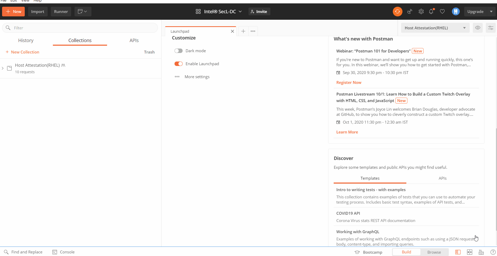

# Intel® Security Libraries for Data Center API Collections	

One click Postman API Collections for Intel® SecL-DC use-cases.


## Use Case Collections

| Use case               | Sub-Usecase                           | API Collection      |
| ---------------------- | ------------------------------------- | --------------------|
| Foundational Security  | Host Attestation                      | ✔️                  |
|                        | Data Fencing  with Asset Tags         | ✔️                  |
|                        | Trusted Workload Placement            | ✔️(Kubernetes Only) |
|                        | Application Integrity                 | ✔️                  |
| Launch Time Protection | VM Confidentiality                    | ❌                  |
|  | Container Confidentiality with Docker Runtime | ✔️ |
|  | Container Confidentiality with CRIO Runtime | ✔️ |
| Secure Key Caching |  | ✔️ |
| Security Aware Orchestration |  | ✔️(Kubernetes Only) |


## Requirements

* Intel® SecL-DC services installed and running as per chosen use case and deployment model supported as per Product Guide.
* Quick Start Guide - Foundational & Workload Security: https://github.com/intel-secl/docs/blob/master/quick-start-guides/Quick%20Start%20Guide%20-%20Intel%C2%AE%20Security%20Libraries%20-%20Foundational%20%26%20Workload%20Security.md
* Quick Start Guide - Secure Key Caching: 
https://github.com/intel-secl/docs/blob/master/quick-start-guides/Quick%20Start%20Guide%20-%20Intel%C2%AE%20Security%20Libraries%20-%20Secure%20Key%20Caching.md
* Postman client [downloaded](https://www.postman.com/downloads/) and Installed or accessible via web


## Using the API Collections

### Downloading API Collections

* Postman API Network for latest released collections: https://explore.postman.com/intelsecldc

  or 

* Github repo for all releases

  ```shell
  #Clone the github repo for api-collections
  git clone https://github.com/intel-secl/utils.git
  
  #Switch to specific release-version of choice
  cd utils/
  git checkout <release-version of choice>
  
  #Import Collections from
  cd tools/api-collections
  ```
  > **Note:**  The postman-collections are also available when cloning the repos via build manifest under `utils/tools/api-collections`


### Running API Collections

* Import the collection into Postman API Client

  > **Note:** This step is required only when not using Postman API Network and downloading from Github

  

* Update env as per the deployment details for specific use case

  

* View Documentation

  

* Run the workflow

  

